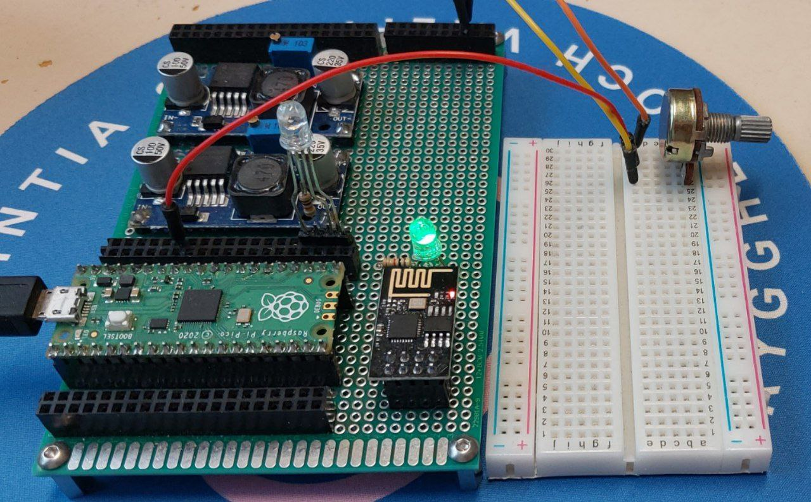

<h1>ESP-01 and raspberry pi pico combination project</h1>

The aim of this small project was to establish the Internet connection for Raspberry Pi Pico (like its W version). To implement this I used the ESP-01 module with ESP-8266 microcontroller. The communication is done via UART interface, and AT commands. The "[ESP plugin](espsocketlib.py)" implemets a class, that is used to configure the esp device through the UART, and to use it for example lika an SoftAP (wi-fi hotspot) with given SSID and password. Also, it can connect to existing hotspot. All this features are implemented, to obtain a data transfering by the use of TCP protocol.

<h2>The board circuitry</h2>

<table>
  <tr>
    <th>Raspberry Pi Pico</th>
    <th>ESP-01</th>
  </tr>
  <tr>
    <td></td>
    <td></td>
  </tr>
</table>

The circuit board was designed for making projects with such a hybrid. To make it able to detach the raspberry pi and the esp. Connection is established by the goldpins.

The RGB diode, near the ESP, used for indication of the ESP status:

<ul>
  <li>blue - SoftAP mode</li>
  <li>blinking blue - connecting to wi-fi</li>
  <li>green - connected to wi-fi</li>
  <li>red - failed to connect to wi-fi</li>
</ul>

Also, there is there are 2 buck step-down converters. Their outputs are connected to the powerlines on the right side (the 5-volt line is bigger). The first converter's feedback resistance is configured in the way, that it outputs the 3.3V. The second converter is configured to output 5 volts(only if there is an additional external power supply, which has greater than 5 volts voltage). If there is no need for additional power supply

<h2>Project applications</h2>

One of the project applications was to make a full-duplex transferring protocol, on the basis of TCP transfer protocol, to connect the raspberry pi pico to devices, acting like a TCP servers, and to control the raspberry pi pico through the desktop or a phone app.

To do the app, I used a Godot4 game engine, which allows to export the same project for different platforms and also has the ability to manipulate on TCP connection manually. To use this kind of connection, I wrote the ESP plugin for the engine.

The circuitry for the example implementation is:

The potentiomenter was connected to 3V power line, and its output is connected to one of Raspberry Pi Pico ADC pins (GPIO 28). The 2nd RGB LED is connected to last pins (GPIO 18, 17 and 16). The RGB color is being set by 3 PWM, regulating brightness of each color in the diode. In a perfect case, the RGB diode should have had 3 different input resistances for each color, but, concerning it firstly as a prototype, it is a negligible issue.

 The Godot program works in the way, that it accepts the signals, comming from the potentiometer, to rotate a 3d object. Also, it in the same time sends the hex value of a color, which is on the color picker.The "ESP circuit plugin" works in the way, that it is being attached to the main tree, and is being used as a TCP server. When there is any data collected (the number of available bytes is not zero), module calls a signal, to transfer the accepted string of command and the data. 

