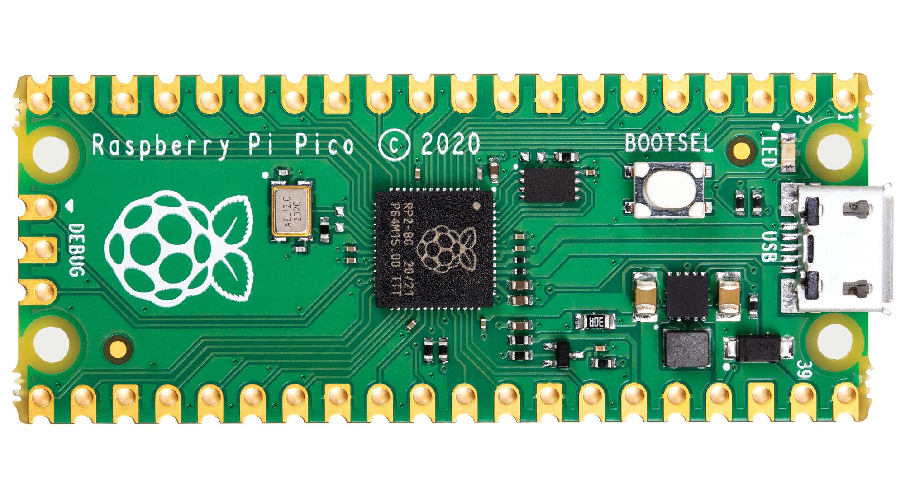
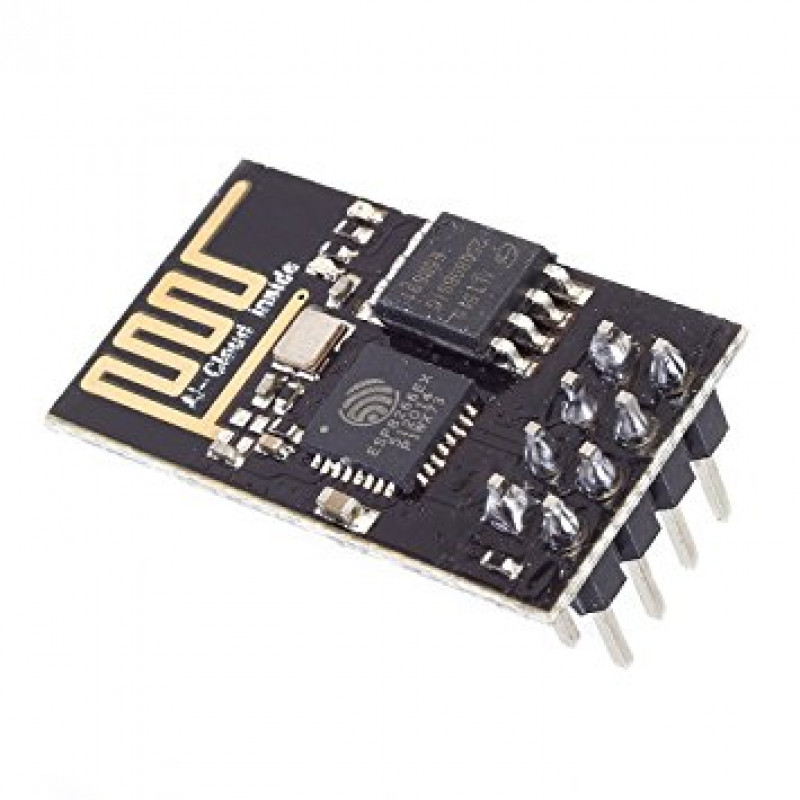
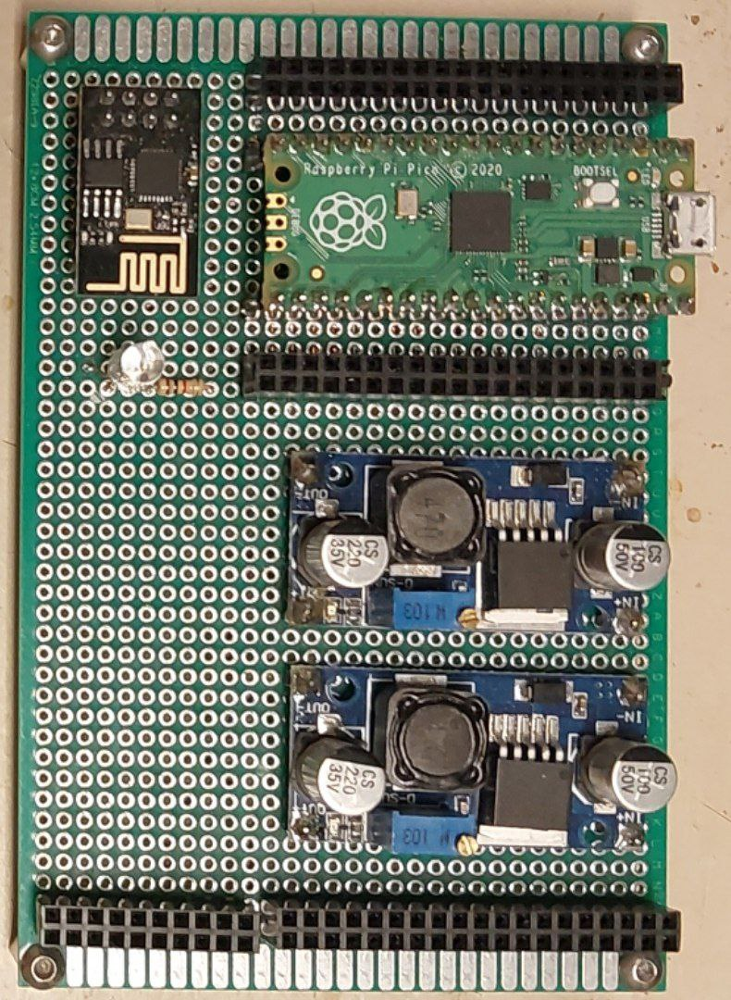

<h1>ESP-01 and raspberry pi pico combination project</h1>

The aim of this small project was to establish the Internet connection for Raspberry Pi Pico (like its W version). To implement this I used the ESP-01 module with ESP-8266 microcontroller. The communication is done via UART interface, and AT commands. The espsocketlib implemets a class, that is used to configure the esp device through the UART, and to use it for example lika an SoftAP (wi-fi hotspot) with given SSID and password. Also, it can connect to existing hotspot. All this features are implemented, to obtain a data transfering by the use of TCP protocol.

<h2>The board circuitry</h2>

<table>
  <tr>
    <th>Raspberry Pi Pico</th>
    <th>ESP-01</th>
  </tr>
  <tr>
    <td></td>
    <td></td>
  </tr>
</table>

The circuit board was designed for making projects with such a hybrid. To make it able to detach the raspberry pi and the esp. Connection is established by the goldpins.

The RGB diode, near the ESP, used for indication of the ESP status:

<ul>
  <li>blue - SoftAP mode</li>
  <li>blinking blue - connecting to wi-fi</li>
  <li>green - connected to wi-fi</li>
  <li>red - failed to connect to wi-fi</li>
</ul>

Also, there is there are 2 buck step-down converters. Their outputs are connected to the powerlines on the right side (5 volt line is bigger). The first converter's feedback resistance is configured in the way, that it outputs the 3.3V. The second converter is configured to output 5 volts(only of there is an additional external power supply, which has greater than 5 volts voltage). If there is no need for additional power supply

